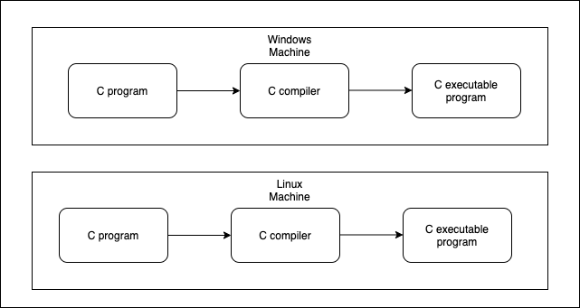
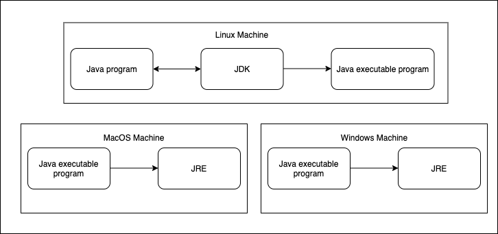

# Introduction to Software Design Architecture

Here, we are going to study the basics of software design architecture based on the book [`Introdução à Arquitetura de Design de Software`](https://www.amazon.com.br/Introdu%C3%A7%C3%A3o-%C3%A0-Arquitetura-Design-Software/dp/8535250298) by Paulo Silveira.

I chose this book as reference because it was one of the best readings I had ever had when I was striving to improve my software development skills as a young software engineer.

The book uses the Java Platform as its development approach, so it details a lot about Java and its Virtual Machine. For this review, we are going to briefly talk about the Java Platform without getting into much details. Our purpose is to focus on the generic software design and architecture subjects. Anyways, feel welcome to dive into the book for more details about Java.

Next, we are going to discuss the following topics:

- [Introduction to Software Design Architecture](#)
- [The Java Platform](#the-java-platform)
- [Object Oriented Programming Topics](#)
- [Software Responsibilities](#)
- [Tests and Automation](#)
- [Architecture Decisions](#)
- [Web and REST system integrations](#)

## The Java Platform

Understanding your development ecosystem is a must for designing and architecturing good software. Knowing the strengths and weaknesses of such platforms helps us to point out their advantages and limitations for our projects. For that reason, we are now going to take a brief look into the Java, one of the most used and successful software development and execution platforms in the world.

Standardly released for the first time back in [1996](https://www.codejava.net/java-se/java-se-versions-history), Java has been created for serving as a software development & execution platform. It was built based on three pilars:

- The Java Virtual Machine (JVM)
- Its APIs
- The Java language

The JVM plays as the key role in the Java platform. It enables Java programs to be compiled and executed abstractly for both hardware and operating systems.

> What the heck does that mean?

A [C compiler](https://gcc.gnu.org/) turns a [C programm](https://www.programiz.com/c-programming) into the specific hardware instructions. The generated executable program is made to run only on that specific machine it was compiled on. If you try to run that the executable in another machine or operating system (OS), it will certainly break.

On this such scenario, a C program needs to be compiled for each machine and OS we want it to be executed on:

On the other hand, the JVM makes those portability cases a lot simpler. A Java compiler generates an executable program for a **generic application virtual machine**, the JVM. The JVM is a specification of a complete virtual machine which is responsible for abstracting the communication with the Operating System and its hardware. Therefore, instead of compiling a Java program for each running machine/OS, we can simply provide them a JVM environment, so they all can run the same executable program through that virtual machine.

> You may feel free to argue that we still depend on a JVM environment specifically for each machine or operating system we want to work with. That is a fact!! However, once we have these JVM implementations, we can execute any Java program which is compatible with that JVM implementation.

In order to enable such scenarios, the Java platform offers the follwing two software pieces:

- **The JDK (Java Development Kit):** contains the JVM machine, APIs and Java Language for enabling software development.

- **The JRE (Java Runtime Environment):** contains the JVM machine and APIs for executing Java compiled programs.

### The Java's bytecodes

**Bytecodes** are instructions for the Java Virtual Machine. They are equivalent to assembly commands for low level machine coding. Each instruction is called **opcode**, and it has the size of 1 byte.

The Java compiler turns `.java` into `.class` files which contain the bytecode instructions. These instructions are executed by the JVM. For that matter, the JVM and bytecodes are the most important features in the Java platform.

The JVM is a specification guided by the [Java Community Process](https://www.jcp.org/en/home/index) (JCP). Therefore, many [vendors](https://en.wikipedia.org/wiki/List_of_Java_virtual_machines) have created different JVM implementations according to the JCP specifications. New specifications are made through Java Specification Request (JSR) documents. Those requests can take quit a long time to be approved as the JCP has to guarantee the community interest and acceptance of the new implementations.

Since the bytecodes were what matters for a JVM machine, many other programming languages have been created for the Java Platform. We can find a list out [here](https://www.whoishostingthis.com/compare/java/jvm-programming/). The language you may want to use depends entirely of the problem you have to solve.

> One interesting thing to note here is that the Java Platform has grown to a such level of specification that we do not even need to use the Java language itself.
